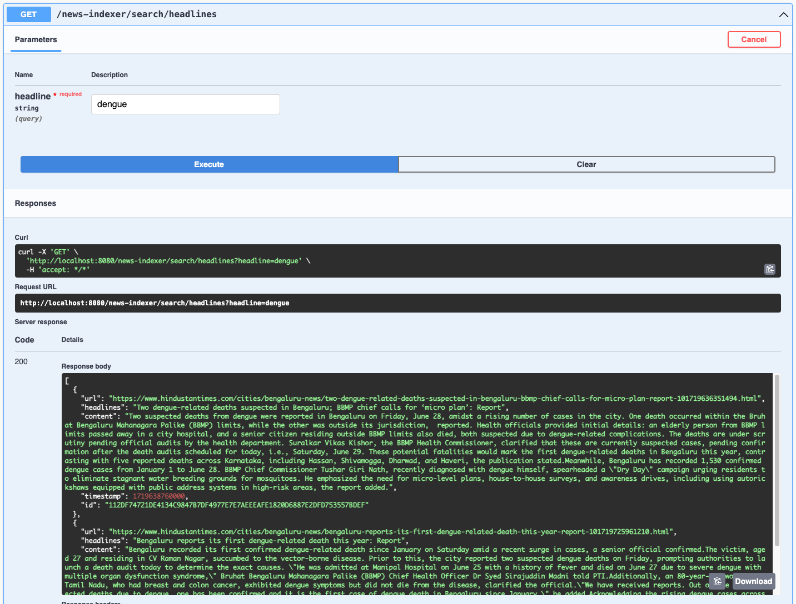

# web-scrape-indexer
Scrapes websites using Scrapy and makes it searchable in Elasticsearch

## How to run?

### Run Indexer
```bash
cd indexer
./gradlew build
./gradlew bootRun
```

### Run Crawler
In a separate terminal
```bash
cd scrapper/simple-scrapper
scrapy crawl news-spider
```

## Validate
Open http://localhost:8080/swagger-ui/index.html

Play around the endpoints

